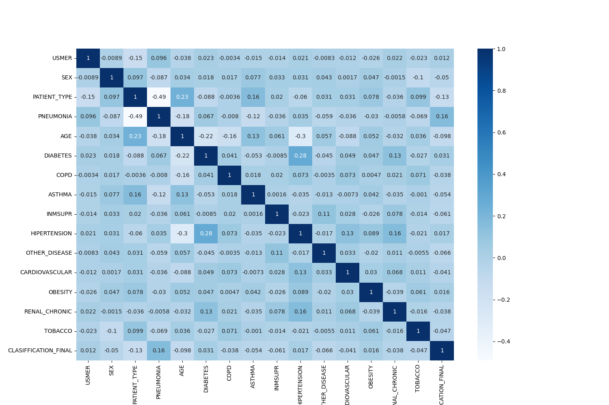
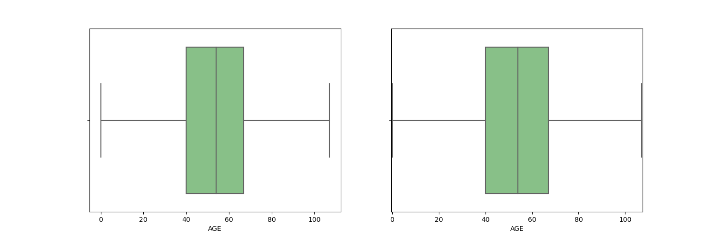
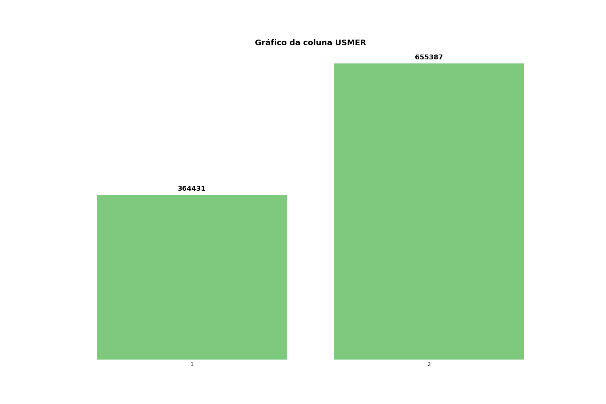

# Projeto COVID-19 🦠

## índice 🏹
- <a href="#">Contextualização do Projeto COVID-19</a>
- <a href="#dados-utilizados">Dados Utilizados</a>
- <a href="#tecnologias-utilizadas">Tecnologias Utilizadas</a>
- <a href="#bibliotecas-utilizadas">Bibliotecas Utilizadas</a>
- <a href="#explicação-do-andamento-do-projeto">Explicação do andamento Projeto</a>
- <a href="#olá-eu-sou-o-lucas!-👋">Sobre Mim</a>

## Contextualização do Projeto COVID-19
Este projeto visa analisar o histórico médico de indivíduos para determinar se estão em um grupo de risco para o COVID-19. Embora a pandemia já tenha passado, optei por prosseguir com este projeto, pois acredito que uma solução baseada em inteligência artificial poderia oferecer benefícios significativos tanto para o público em geral quanto para os profissionais da saúde. Ao fornecer essas informações, poderíamos direcionar recursos e atenção de forma mais eficaz, visando o bem-estar e a prevenção de doenças.

## Dados utilizados
A base de dados utilizada se encontra no link https://www.kaggle.com/datasets/meirnizri/covid19-dataset/data, a base de dados é se encontra com as seguintes informações:

Caso apareça os valores 97, 98 ou 99 são dados que estão faltando na base da dados. E 1 significa 'sim', 2 significa 'não'.

- sex: 1 para feminino e 2 para masculino.

- age: idade do paciente.

- classification: resultados do teste de covid. Valores de 1 a 3 significam que o paciente foi diagnosticado com covid em diferentes graus. 4 ou mais significa que o paciente não é portador de covid ou que o teste é inconclusivo.

- patient type: tipo de cuidado recebido pelo paciente na unidade. 1 para retorno para casa e 2 para hospitalização.

- pneumonia: se o paciente já possui inflamação nos sacos de ar ou não.

- pregnancy: se o paciente está grávida ou não.

- diabetes: se o paciente tem diabetes ou não.

- DPOC: Indica se o paciente tem doença pulmonar obstrutiva crônica ou não.

- asthma: se o paciente tem asma ou não.

- inmsupr: se o paciente é imunossuprimido ou não.

- hypertension: se o paciente tem hipertensão ou não.

- cardiovascular: se o paciente tem doença relacionada ao coração ou aos vasos sanguíneos.

- renal chronic: se o paciente tem doença renal crônica ou não.

- other disease: se o paciente tem outras doenças ou não.

- obesity: se o paciente é obeso ou não.

- tobacco: se o paciente é fumante.

- USMR: Indica se o paciente foi tratado em unidades médicas de primeiro, segundo ou terceiro nível.

- medical unit: tipo de instituição do Sistema Nacional de Saúde que forneceu o atendimento.

- intubed: se o paciente foi conectado ao ventilador.

- ICU: Indica se o paciente foi admitido em uma Unidade de Terapia Intensiva.

- date died: Se o paciente morreu, indica a data da morte; caso contrário, 9999-99-99.

## Tecnologias Utilizadas
[](https://www.python.org/)


Escolhi Python como linguagem principal para meu código em Ciência de Dados devido à sua versatilidade e eficácia no ecossistema dessa área. A vasta gama de bibliotecas especializadas, como NumPy, Pandas e Scikit-Learn, oferece ferramentas poderosas para manipulação de dados, análise estatística e implementação de modelos preditivos, simplificando significativamente o desenvolvimento e a execução de tarefas complexas.

Além disso, a comunidade ativa e o suporte robusto em Python proporcionam recursos valiosos, facilitando a resolução de problemas e a implementação de soluções inovadoras. A sintaxe clara e legível de Python contribui para um código mais compreensível, promovendo a colaboração e a manutenção eficiente do projeto em Ciência de Dados.

## Bibliotecas utilizadas
Instale as bibliotecas utilizadas no projeto, como o projeto é extenso existem várias bibliotecas para serem instaladas, algumas bibliotecas utilizadas no projeto já vem instaladas no python por padrão, destas usaremos a datetime . Para realizar as instalações abra o cmd e digite:

```bash
  pip install pandas
```
```bash
  pip install numpy
```
```bash
  pip install matplotlib
```
```bash
  pip install seaborn
```
```bash
  pip install cycler
```

# Explicação do andamento do projeto
Na fase inicial do projeto precisei entender a base de dados, para analisar o que cada coluna me traria de informação e conseguir enteder como seguir com o projeto, então depois de importar a base de dados coloquei os primeiros 1000 valores em um documento .csv para analisar as informações presentes, depois de analisar esses dados procurei por valores 'vazios', nesta base de dados dos valores vazios são valores de 97 a 99, então percebi que As colunas INTUBED, PREGNANT e ICU possuem muitos valores faltando (97), por isso preencher esses valores com algum padrão pode prejudicar nosso modelo, então decidi excluir essas colunas, para as outras que possuiam poucos valores faltando eu apenas excluí as linhas, já que nossa base de dados tem 1048575 linhas então perder poucos valores não interferiria no nosso modelo futuro.

Depois de limpar nossa base de dados eu tive que pesquisar mais para entender os dados que estavam presentes na nossa base de dados, tanto para saber como eu deveria interpretá-los e como eu deveria seguir com a nossa base, então tive que pesquisar tanto sobre o covid, como algumas coisas sobre o sistema de saúde no méxico, já que a nossa base de dados vem de lá.

Após isso tive que fazer uma análise explanatória dos dados, criando gráficos para o melhor entendimento dos dados.




Esse gráfico faz uma correlação de cada coluna, ou seja, calcula a correlação entre todas as combinações possíveis de pares de colunas em um conjunto de dados. Ele fornece uma medida estatística que indica a força e a direção da relação entre as variáveis, sendo útil para entender se elas aumentam ou diminuem juntas (correlação positiva), se uma aumenta enquanto a outra diminui (correlação negativa) ou se não há uma relação clara entre elas.

Depois precisei fazer a análise explanatória dos nossos dados, analisando os outliers e gerando gráficos para ver como os valores estão distríbuidos no DataFrame.


Nesse gráfico vemos como estão distríbuidos os nossos dados nos quartos quartis (Os quartis são medidas estatísticas que dividem um conjunto de dados ordenados em quatro partes iguais. ) e os outliers.



Aqui eu gerei um gráfico para entender como os valores estavam sendo distríbuidos nas diversas colunas, então precisei fazer isso para cada coluna e deixei alguns comentários para explicar os dados análisados em cada coluna.


- Próximos passos:
    - Estudar sobre como posso montar essa IA
    

# Olá, eu sou o Lucas! 👋
Aos 19 anos, trilho meu caminho na Ciência de Dados com paixão pela programação. Com habilidades avançadas em Python e conhecimento intermediário em SQL, enfrento desafios com entusiasmo, especialmente na criação de inteligência artificial. Embora meu inglês seja inicial, estou dedicado aos estudos para aprimorá-lo. Estou aqui para aprender, crescer e deixar minha marca na interseção entre dados e inovação.

## Links para me contatar 🔗 
[](https://github.com/LucasSantos875478)
[](https://www.linkedin.com/in/lucas-santos-454584285/)
[](https://www.instagram.com/lucassantos875478/)


